# Development of an Epilepsy Seizure Prediction Cap Device

## Team Members
- Dipan Dhali
- Dasari Venkata Sri Sai Akshay Kumar
- Chapa Abhiram
- Shivam Kumar Jha
- Guntupalli Venkateswarlu 
- Ankem Avinash 

**Mentor**: Prof. Sanjeev Narayan Sharma

## Abstract
Epilepsy affects millions of individuals worldwide, often leading to unpredictable and dangerous seizures. Early prediction of epileptic seizures can significantly improve patient safety and quality of life. In this work, we present the development of a real-time wearable cap device designed for epilepsy seizure prediction. The cap integrates multiple EEG electrodes with a portable data acquisition system, transmitting neural signals to an onboard processing unit. Using advanced signal preprocessing techniques and a customized machine learning workflow, our system identifies pre-seizure patterns with high accuracy. We trained the model using publicly available EEG datasets, applying various feature extraction methods. Our device demonstrates promising results, achieving high accuracy and low false alarm rates while maintaining real-time performance on low-power hardware. Compared to existing bulky or non-portable systems, our solution offers an affordable, wearable, and efficient approach for real-time epilepsy monitoring.

**Keywords**: Epilepsy, Seizure prediction, Wearable device, Electroencephalogram, Signal preprocessing, Machine learning

## 1. Introduction
Epilepsy is a chronic neurological disorder characterized by recurrent, unprovoked seizures, affecting approximately 50 million people worldwide. Seizures can cause sudden disruptions in consciousness, movement, or behavior, posing significant risks to patients' safety and quality of life. Predicting seizures before they occur remains one of the most critical challenges in epilepsy management, as early warnings can enable patients to seek safety, administer medication, or alert caregivers.

Current seizure detection systems, including implanted devices and bulky monitoring setups, either lack portability or require invasive procedures. Wearable EEG-based systems offer a non-invasive, patient-friendly alternative, but many existing solutions suffer from high false alarm rates, limited real-time capabilities, or impractical designs for daily use.

In this work, we present the development of an Epilepsy Seizure Prediction Cap Device — a lightweight, wearable system designed to acquire scalp EEG signals in real-time, process the data using machine learning algorithms, and accurately predict seizure events before onset. Our device integrates affordable bio-potential recording hardware with efficient signal processing and predictive modeling pipelines, enabling continuous monitoring without compromising patient comfort.

By focusing on real-time seizure prediction, portability, and user-friendliness, this study aims to contribute toward safer and more effective epilepsy management solutions.

The proposed system not only prioritizes early and accurate seizure prediction but also emphasizes seamless integration with alert mechanisms such as mobile notifications, SMS, or automated caregiver alerts. Furthermore, the modular design of the cap allows for future enhancements, including cloud-based data storage, personalized model training, and integration with smart healthcare ecosystems. Through this work, we envision a comprehensive solution that empowers patients with greater independence, enhances clinical decision-making, and advances the broader field of wearable neurotechnology.

## 2. Project Workflow
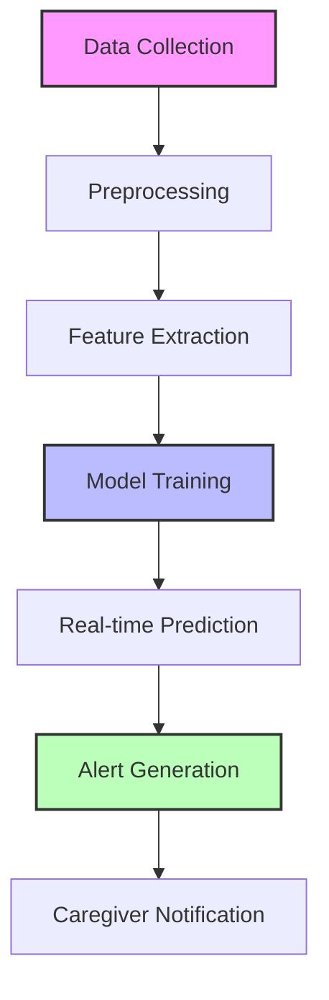

## 3. Related Research
Epilepsy seizure management has traditionally relied on real-time seizure detection rather than prediction. Detection systems identify seizures after onset based on characteristic EEG changes, but they offer little to no advance warning, limiting opportunities for preventive action. Seizure prediction, which aims to identify early pre-ictal brain patterns, is significantly more challenging but far more valuable in enabling proactive intervention.

### EEG Signal Classification
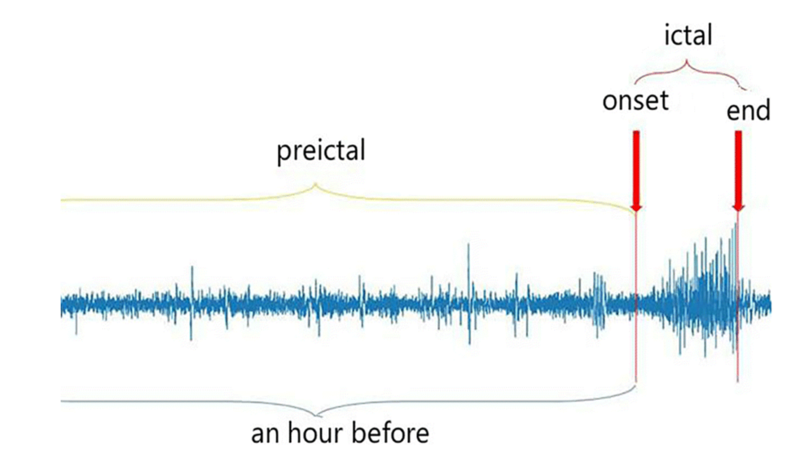
*Figure 1: EEG Signal Classification Process*

A variety of machine learning and deep learning approaches have been explored for seizure detection and prediction from EEG signals:

- **Convolutional Neural Networks (CNNs)**: Automatically learn spatial EEG features and have shown high detection accuracy. However, CNNs typically require large datasets and high computational power, making them less ideal for low-power wearable devices.

- **Long Short-Term Memory Networks (LSTMs)**: Specifically designed to capture temporal patterns in EEG signals, improving seizure prediction performance. However, they are often resource-intensive and can overfit on small datasets.

- **Hybrid CNN-LSTM Models**: Combine spatial and temporal feature extraction for high accuracy. Several studies report prediction sensitivities above 90% on CHB-MIT datasets. Yet, the model size and inference latency are too large for lightweight real-time deployment without significant model-compression.

- **Wavelet Transform + Machine Learning**: Several researchers have used wavelet-based feature extraction combined with SVM, Random Forest, or XGBoost classifiers. These methods balance performance and speed well but require careful feature selection.

### 3.1 Important Observations
- Deep learning models (CNNs, LSTMs) achieve high performance but are often too resource-heavy for real-time wearable devices.
- Classical ML models (Random Forest, SVM) combined with effective feature extraction (like Wavelets, Hjorth parameters) offer a good trade-off for real-time portable seizure prediction systems.

## 4. Methodology

### Project Flow
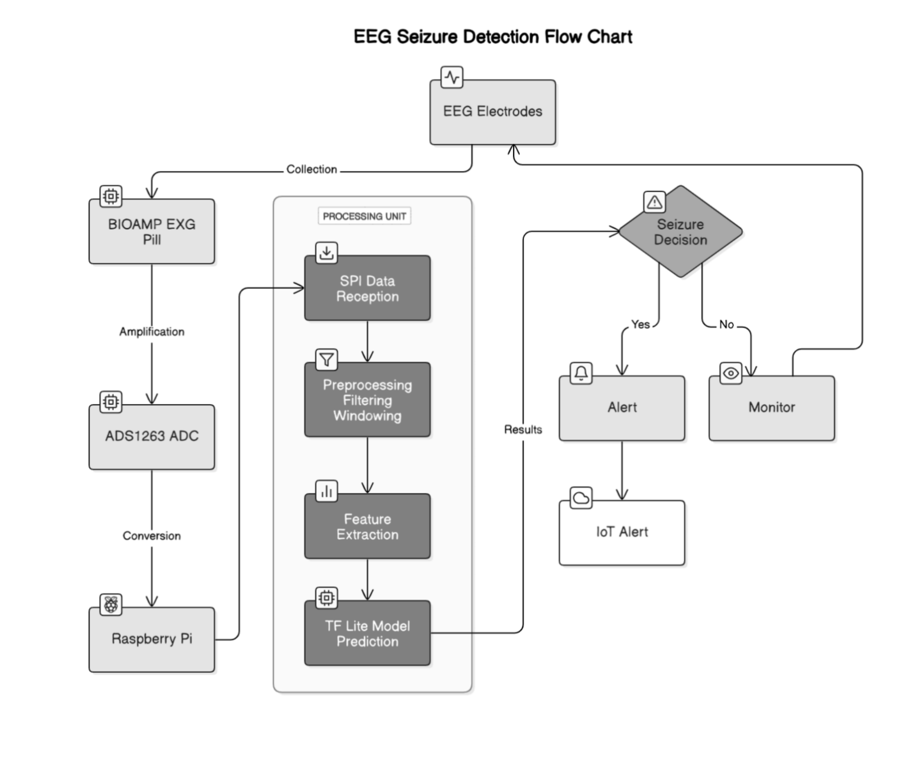
*Figure 2: Overall Project Flow*

### 4.1 Software Components

#### 4.1.1 Datasets
In this study, three publicly available EEG datasets were utilized to develop and evaluate the seizure prediction model. These datasets were carefully curated to ensure that only recordings containing useful seizure-related information were included.

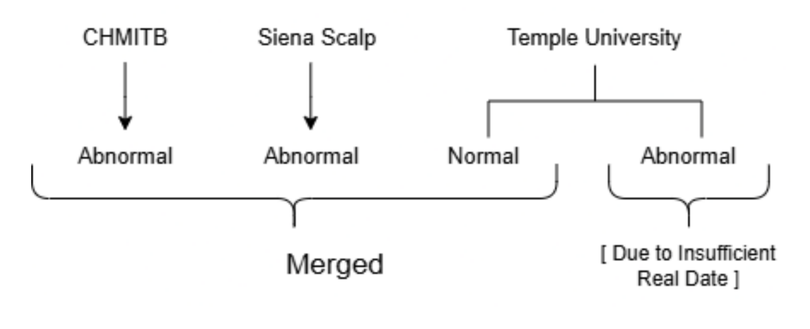
*Figure 3: Dataset Overview and Characteristics*

The datasets used were:
1. CHB-MIT Scalp EEG Database (PhysioNet)
   - Contains pediatric patient recordings
   - Sampled at 256 Hz
   - Selected abnormal recordings with clear seizure annotations

2. Siena Scalp EEG Dataset
   - Adult scalp EEG recordings
   - Sampled at 512 Hz
   - Selected abnormal recordings with clear seizure annotations

3. Temple University EEG (TUEG) Dataset
   - Large collection of normal and abnormal recordings
   - Used normal recordings to augment inter-ictal class
   - Improved model robustness and generalization

#### 4.1.2 Data Flow and Processing Pipeline

#### 4.1.3 Signal Analysis

##### Normal EEG Analysis
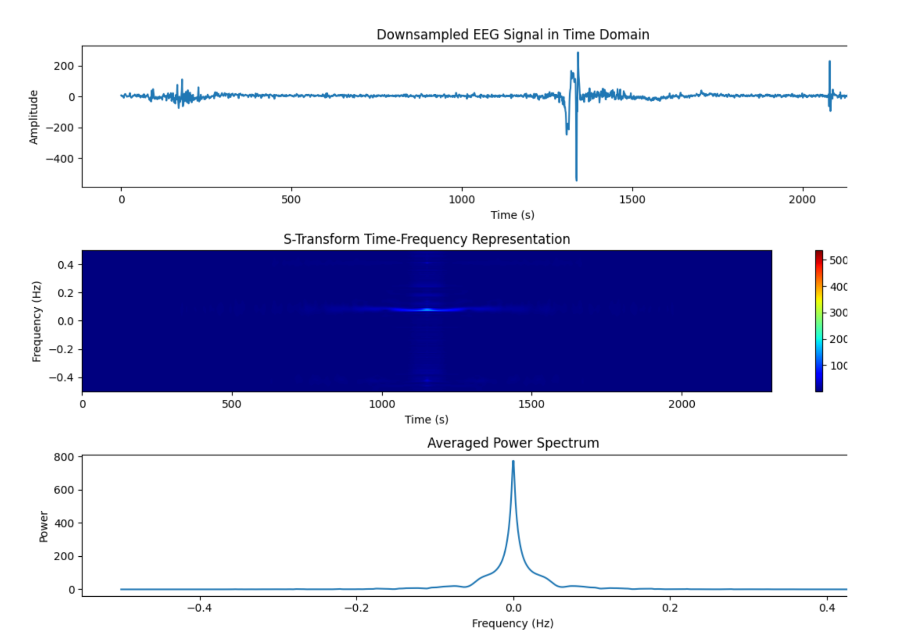
*Figure 4: Normal EEG Signal Pattern*

##### Pre-Ictal EEG Analysis
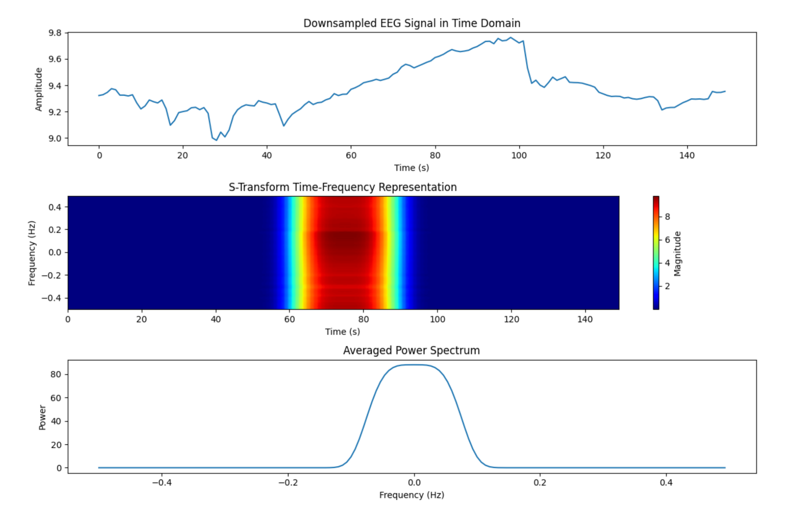
*Figure 5: Pre-Ictal EEG Signal Pattern*

#### 4.1.4 Model Architecture
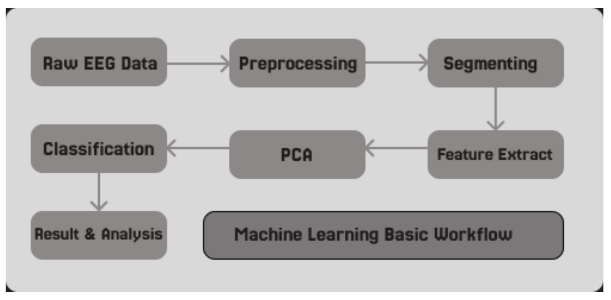
*Figure 6: Neural Network Architecture*

#### 4.1.5 Results and Performance
Our model achieved significant results on the test dataset:

- **Total files tested**: 896
- **Seizure files**: 42
  - Correctly predicted: 37
  - Missed predictions: 5
- **Normal files**: 854
  - False predictions: 37
  - Correct normal predictions: 817

Performance Metrics:
- **Accuracy**: 95.45%
- **Precision**: 0.50
- **Recall**: 0.88
- **F1-Score**: 0.64

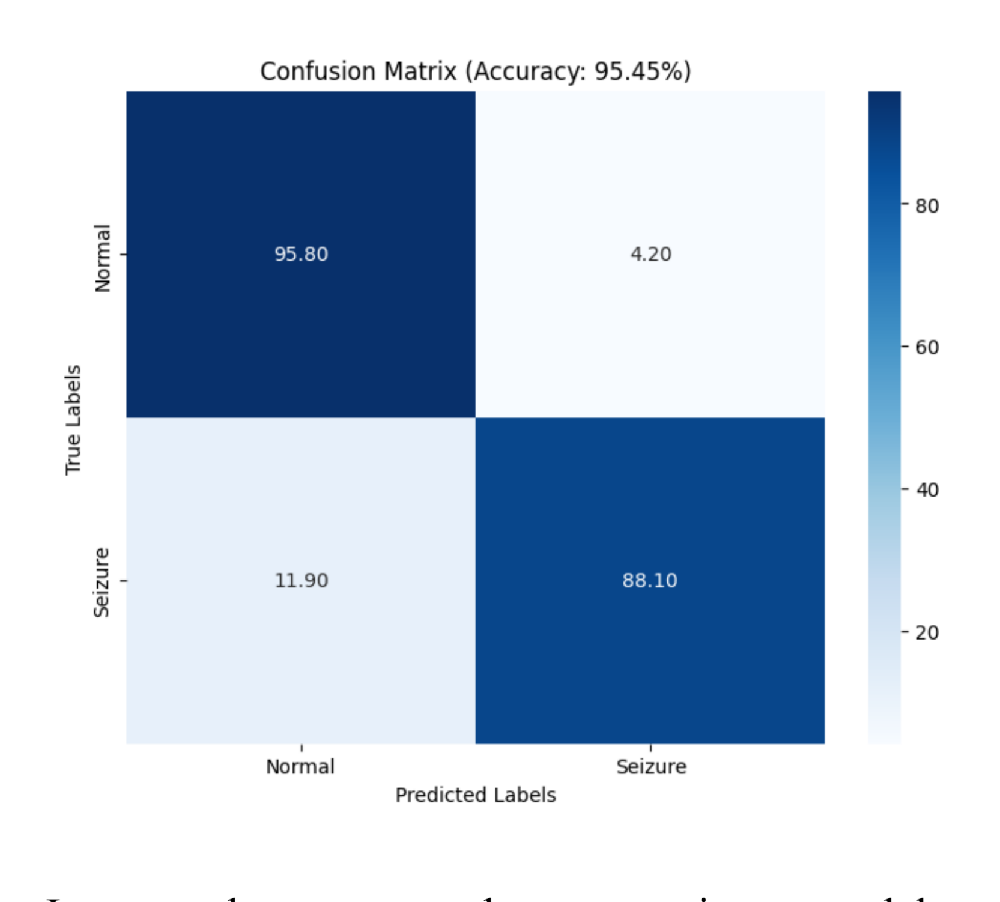
*Figure 7: Confusion Matrix of Model Performance*

### 4.2 Hardware Components

#### Hardware Architecture
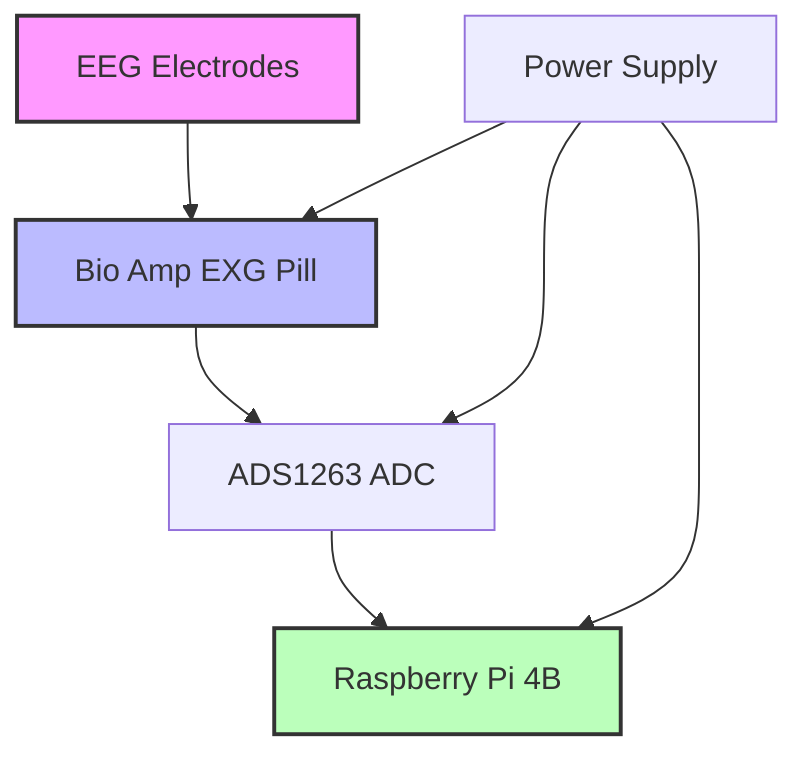

#### 4.2.1 Circuit Diagrams
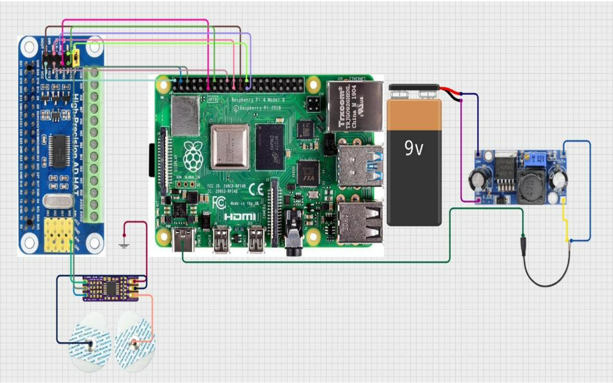
*Figure 8: Complete Circuit Diagram*

#### 4.2.2 Component Details
- **ADS1263 Pinout**
  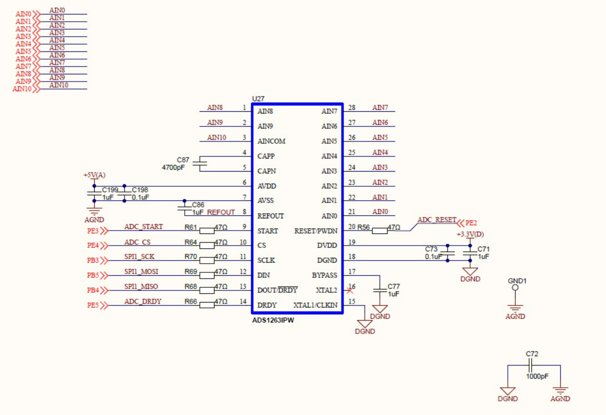
  *Figure 9: ADS1263 Pin Configuration*

- **Bioamp EXG Pill**
  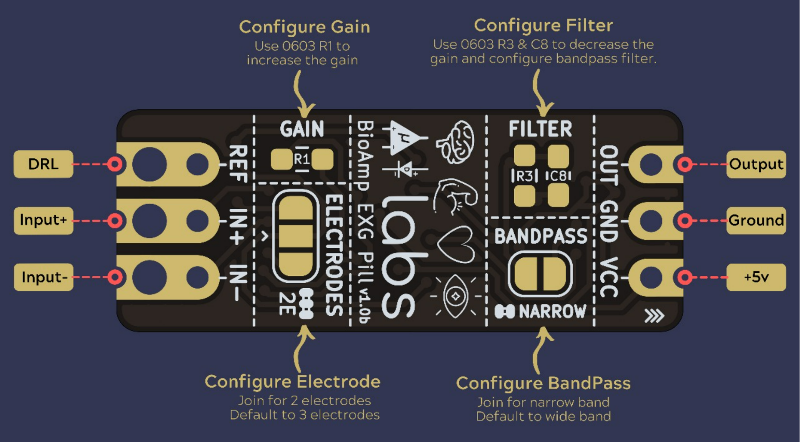
  *Figure 10: Bioamp EXG Pill Details*

- **Raspberry Pi 4B Pinout**
  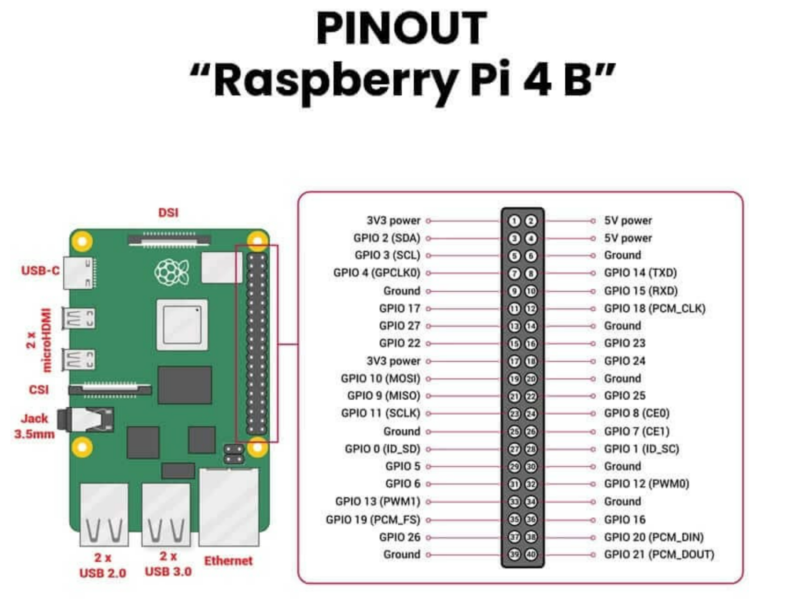
  *Figure 11: Raspberry Pi 4B Pin Configuration*

#### 4.2.3 Component Specifications

| Feature/Spec | BioAmp EXG Pill | ADS1263 | Raspberry Pi 4B |
|--------------|-----------------|----------|-----------------|
| Purpose | Analog biopotential signal amplifier | Precision ADC (24-bit) | Host processor for data processing |
| Power Supply | 3.3V--5V | 3.3V or 5V | 5V via USB-C |
| Output Type | Analog (±1.5V swing) | SPI (24-bit digital) | SPI master, GPIO, UART, etc. |
| Input Voltage Range | ±1.5V (single-ended) | ±2.5V (differential) @ 5V ref | N/A |
| Signal Bandwidth | ~0.5Hz -- 100Hz (EEG optimized) | Supports up to 38.4kSPS | N/A |
| Gain | Fixed (1000x) | Configurable (via software) | N/A |
| ADC Resolution | N/A | 24-bit | Internal 10-bit (not used in this setup) |
| Communication | Analog Output | SPI (DIN, DOUT, SCLK, CS, DRDY) | SPI (GPIO10--11--9--8), I2C, UART, USB |
| Channel Support | 1 per pill | 10 analog channels | 40 GPIO pins (multiple functions) |
| Application Role | EEG sensor/amplifier | EEG signal digitizer | Processing, analysis, storage, transmission |
| Sampling Rate | Analog continuous | Up to 38.4kSPS | Depends on software loop / model |
| Typical Use Case | Captures EEG signals | Converts analog EEG to digital | ML model inference, GUI display |
